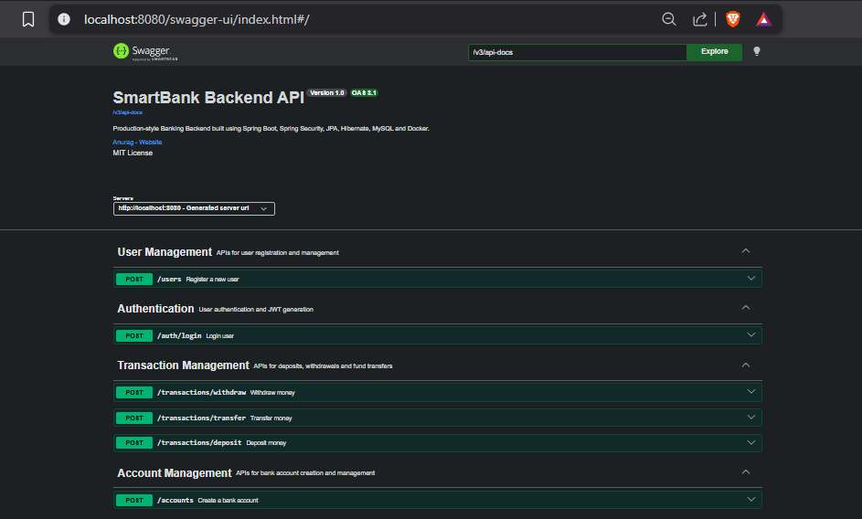
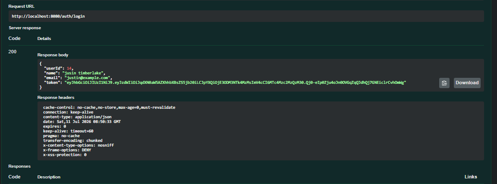
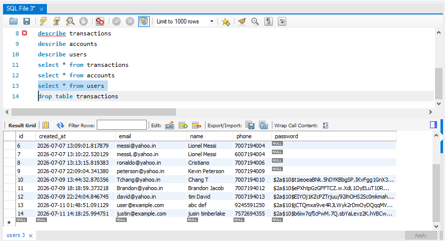

# 🏦 SmartBank Backend

SmartBank Backend is a production-style banking REST API built using Spring Boot.

The project demonstrates backend development concepts including layered architecture, DTO pattern, validation, authentication, exception handling, Docker, and API documentation.

The application allows users to:

- Register securely
- Authenticate using JWT
- Create bank accounts
- Deposit money
- Withdraw money
- Transfer funds between accounts

This project was built as part of a backend engineering learning roadmap to simulate real-world banking software architecture.

## Features

- User Registration
- JWT Authentication
- Bank Account Creation
- Cash Deposit
- Cash Withdrawal
- Account-to-Account Transfer
- Bean Validation
- Global Exception Handling
- Layered Architecture
- DTO Pattern
- JPA/Hibernate
- Docker Support
- Swagger/OpenAPI Documentation
- Unit Testing (JUnit & Mockito)

## Tech Stack

- Java 21
- Spring Boot 3
- Spring Security
- Spring Data JPA
- Hibernate
- MySQL
- Docker & Docker Compose
- Swagger/OpenAPI
- JWT (JSON Web Tokens)
- Maven
- JUnit 5
- Mockito

## Architecture

The project follows a layered architecture to separate responsibilities and improve maintainability.

```text
Client
   │
   ▼
Controller
   │
   ▼
Service
   │
   ▼
Repository
   │
   ▼
Hibernate / JPA
   │
   ▼
MySQL
```

### Layer Responsibilities

- **Controller** – Handles HTTP requests and responses.
- **Service** – Contains business logic.
- **Repository** – Performs database operations using Spring Data JPA.
- **Hibernate/JPA** – Maps Java entities to database tables.
- **MySQL** – Stores application data.

## Project Structure

```flow
src
├── controller
├── service
├── repository
├── entity
│   └── enums
├── dto
│   ├── request
│   └── response
├── mapper
├── exception
├── security
├── config
└── resources
```

## Database Design

Main Entities:

- User
- Account
- Transaction

Relationships:

User (1)
│
▼
Account (Many)
│
▼
Transaction (Many)

## API Documentation

Swagger/OpenAPI is integrated into the application.

After running the project, open:

```

http://localhost:8080/swagger-ui.html

```

to explore and test all available REST APIs interactively.

## Docker

The application supports Docker Compose.

Run:

```bash
docker compose up --build
```

to start:

- Spring Boot
- MySQL

without manually installing or configuring the database.

## Running Locally

1. Clone the repository

```bash
git clone <https://github.com/anurag-IITgn/smartbank-api>
```

2. Configure MySQL

3. Update `application.properties`

4. Run

```bash
mvn spring-boot:run
```

or launch the application from IntelliJ IDEA.

## SWAGGER HOMEPAGE

## SWAGGER FEATURE EXECUTION

## DOCKER SMARTBANK CONTAINER

## PROJECT STRUCTURE

## MYSQL TABLES



## Future Roadmap

Version 2

- Spring Security Filter Chain
- Role-Based Authorization
- Pagination & Sorting
- Search APIs
- Redis Caching
- Cloud Deployment

Version 3

- AI Financial Assistant
- Spending Analytics
- AI-powered Financial Insights


## Author

**Anurag**

Backend Developer (Java & Spring Boot)

GitHub:
https://github.com/anurag-IITgn